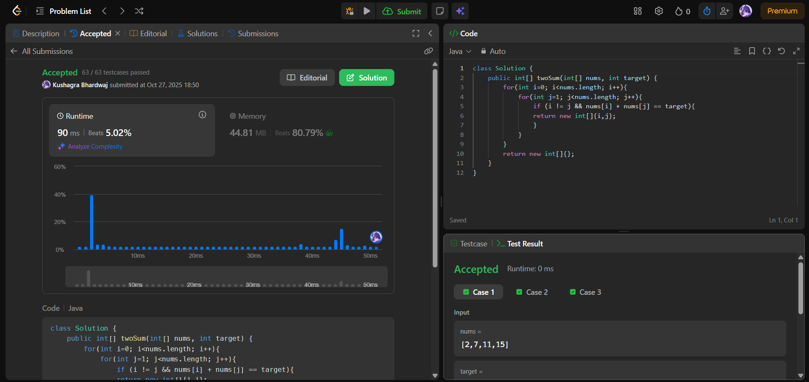
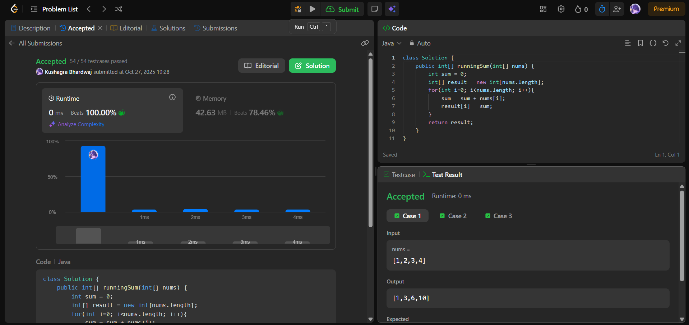

# 🧠 Day 1 – Arrays (Easy)

**📅 Date:** October 27, 2025  
**💻 Language:** Java  
**📚 Topic:** Arrays – Basics  

---

## ✅ Problems Solved
| Problem | LeetCode # | Description |
|:--|:--:|:--|
| [Two Sum](https://leetcode.com/problems/two-sum/) | #1 | Find two indices whose numbers add up to the target. |
| [Running Sum of 1D Array](https://leetcode.com/problems/running-sum-of-1d-array/) | #1480 | Compute running prefix sum for each index in the array. |

---

## 💡 Concepts Practiced
- Array traversal and element access  
- Efficient loop usage and index tracking  
- Returning and printing results in Java  
- Strengthening core array logic patterns  

---

## 🧩 Output Screenshots
| Problem | Result |
|:--|:--|
| Two Sum |  |
| Running Sum of 1D Array |  |

---

## 🏁 Summary
Day 1 of the **100 Days of DSA – Core Edition** ✅  
Refreshed array basics and implemented two classic problems in Java.  
A great start to consistency and logical problem-solving 💪
