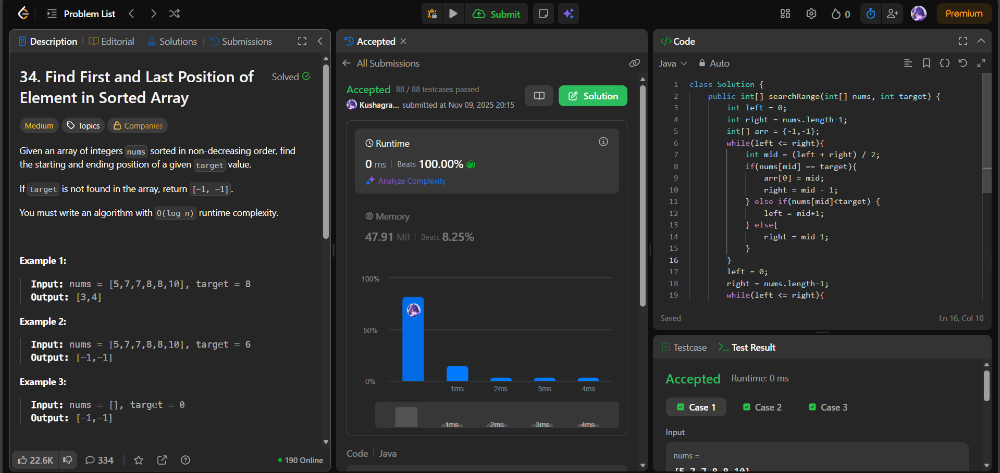

# 🧠 Day 14 – Binary Search (Medium)

**📅 Date:** November 9, 2025  
**💻 Language:** Java  
**📚 Topic:** Binary Search – Boundary Detection & Range Search  

---

## ✅ Problems Solved
| Problem | LeetCode # | Description |
|:--|:--:|:--|
| [Find First and Last Position of Element in Sorted Array](https://leetcode.com/problems/find-first-and-last-position-of-element-in-sorted-array/) | #34 | Find the starting and ending positions of a given target value in a sorted array using two binary searches. |

---

## 💡 Concepts Practiced
- Implemented **two-pass binary search** to find both leftmost and rightmost indices  
- Practiced **boundary tightening** (`right = mid - 1` for left search, `left = mid + 1` for right search)  
- Handled **edge cases** where target is not found (return `[-1, -1]`)  
- Optimized for **O(log n)** time and **O(1)** space  
- Reinforced understanding of **index-based condition control** and **loop boundaries**

---

## 🧩 Output Screenshots
| Problem | Result |
|:--|:--|
| Find First and Last Position of Element in Sorted Array |  |

---