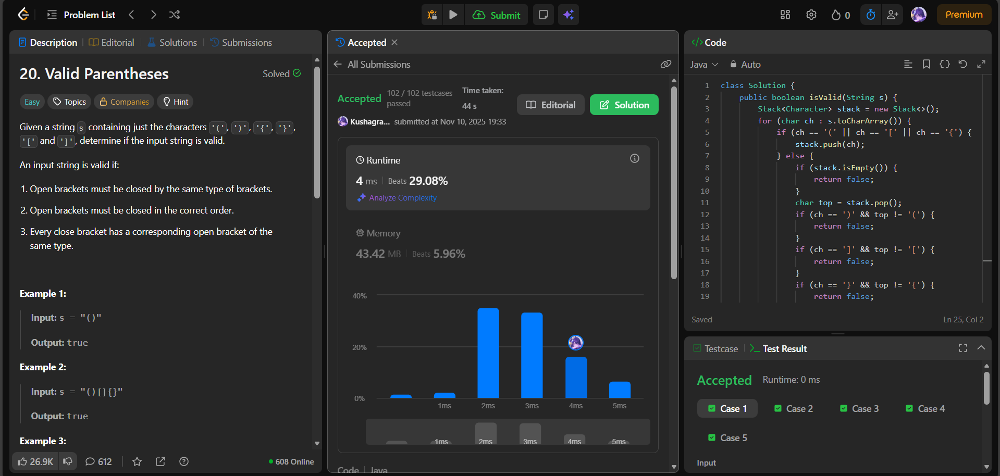

# 🧠 Day 15 – Stack (Easy)

**📅 Date:** November 10, 2025  
**💻 Language:** Java  
**📚 Topic:** Stack – Balanced Parentheses & String Validation  

---

## ✅ Problems Solved
| Problem | LeetCode # | Description |
|:--|:--:|:--|
| [Valid Parentheses](https://leetcode.com/problems/valid-parentheses/) | #20 | Check if a given string containing brackets is valid — every opening bracket must have a matching closing bracket in the correct order. |

---

## 💡 Concepts Practiced
- Used a **Stack** data structure to validate bracket pairs  
- Practiced **push/pop operations** for opening and closing symbols  
- Implemented **character matching** for `'()'`, `'{}'`, `'[]'`  
- Handled **edge cases** like empty strings and mismatched order  
- Achieved **O(n)** time and **O(n)** space complexity  
- Strengthened logic in **string traversal** and **data structure usage**

---

## 🧩 Output Screenshots
| Problem | Result |
|:--|:--|
| Valid Parentheses |  |

---

## 🏁 Summary

Day 15 of the **100 Days of DSA** ✅
Learned to validate balanced brackets using a stack-based approach, ensuring proper order and nesting.
Strengthened understanding of **stack operations, character comparison, and error handling** in string parsing 🧱✅