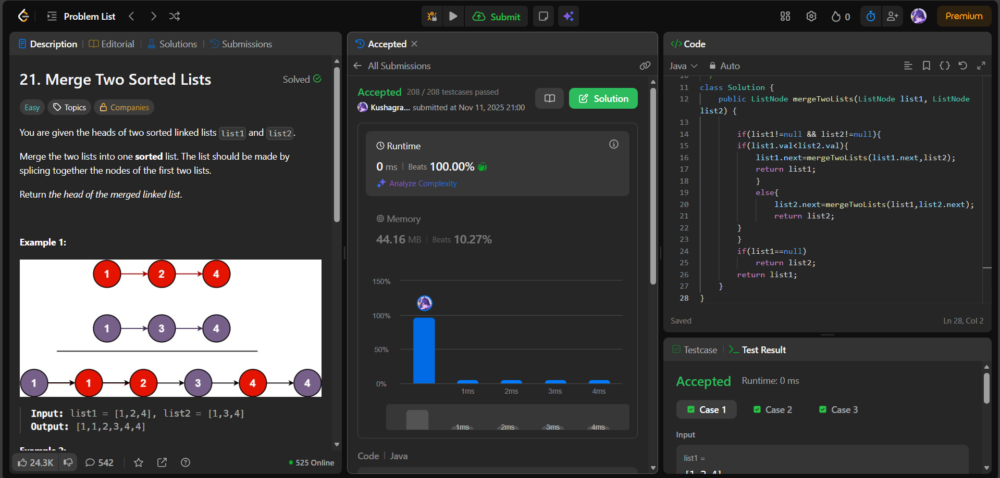

# 🧠 Day 16 – Linked Lists (Easy)

**📅 Date:** November 11, 2025  
**💻 Language:** Java  
**📚 Topic:** Linked Lists – Recursion & Sorted Merge  

---

## ✅ Problems Solved
| Problem | LeetCode # | Description |
|:--|:--:|:--|
| [Merge Two Sorted Lists](https://leetcode.com/problems/merge-two-sorted-lists/) | #21 | Merge two sorted linked lists into one sorted list, returning the head of the merged list. |

---

## 💡 Concepts Practiced
- Implemented **recursive merging** of two sorted linked lists  
- Practiced **base case handling** (`null` list scenarios)  
- Strengthened understanding of **linked list traversal & node references**  
- Compared node values recursively to maintain **sorted order**  
- Achieved **O(n + m)** time and **O(n + m)** space (due to recursion stack)  
- Enhanced recursive problem-solving intuition  

---

## 🧩 Output Screenshots
| Problem | Result |
|:--|:--|
| Merge Two Sorted Lists |  |

---

## 🏁 Summary

Day 16 of the **100 Days of DSA** ✅
Mastered linked **list recursion** by merging two sorted lists elegantly.
Improved understanding of **pointer manipulation, base conditions, and recursive function flow** 🔗⚙️
