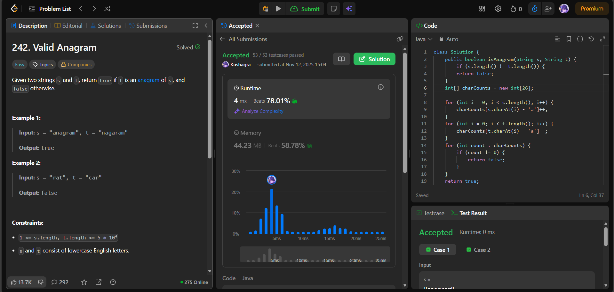

# 🧠 Day 17 – Strings & Hashing (Easy)

**📅 Date:** November 12, 2025  
**💻 Language:** Java  
**📚 Topic:** Strings – Character Frequency & Hashing Logic  

---

## ✅ Problems Solved
| Problem | LeetCode # | Description |
|:--|:--:|:--|
| [Valid Anagram](https://leetcode.com/problems/valid-anagram/) | #242 | Check whether two strings are anagrams of each other — both must contain the same characters with the same frequencies. |

---

## 💡 Concepts Practiced
- Used **frequency counting** via a fixed-size integer array (26 English letters)  
- Practiced **ASCII-based indexing** with `char - 'a'`  
- Ensured **balanced increment-decrement** for each character count  
- Avoided use of extra data structures like `HashMap` for efficiency  
- Achieved **O(n)** time and **O(1)** auxiliary space complexity  
- Strengthened understanding of **string traversal** and **frequency parity**

---

## 🧩 Output Screenshots
| Problem | Result |
|:--|:--|
| Valid Anagram |  |

---

## 🏁 Summary

Day 17 of the **100 Days of DSA** ✅
Implemented a **frequency-based comparison** to check for anagrams efficiently.
Strengthened understanding of **character indexing, frequency balancing, and string hashing logic** 🔤⚙️