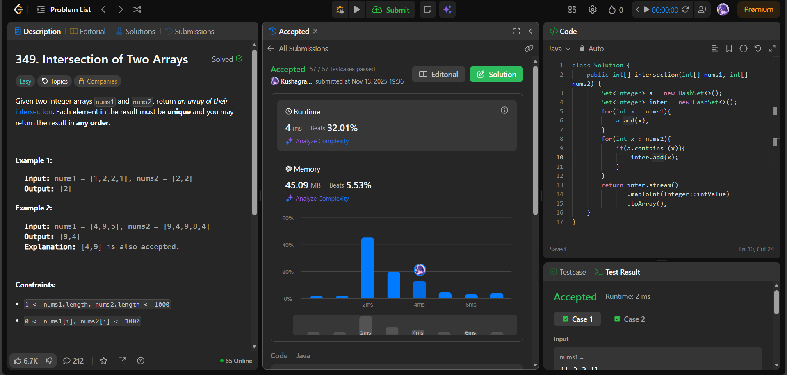

# 🧠 Day 18 – HashSet & Arrays (Easy)

**📅 Date:** November 13, 2025  
**💻 Language:** Java  
**📚 Topic:** Hashing – Set Operations & Array Intersection  

---

## ✅ Problems Solved
| Problem | LeetCode # | Description |
|:--|:--:|:--|
| [Intersection of Two Arrays](https://leetcode.com/problems/intersection-of-two-arrays/) | #349 | Find the intersection of two integer arrays and return the unique elements present in both arrays. |

---

## 💡 Concepts Practiced
- Used **HashSet** to store unique elements from the first array  
- Performed **constant-time lookups** to find common elements  
- Avoided duplicates automatically using set properties  
- Practiced **stream conversion** from `Set<Integer>` to `int[]`  
- Achieved **O(n + m)** time and **O(n)** space complexity  
- Strengthened knowledge of **hashing, set operations, and Java streams**

---

## 🧩 Output Screenshots
| Problem | Result |
|:--|:--|
| Intersection of Two Arrays |  |

---

## 🏁 Summary

Day 18 of the **100 Days of DSA** ✅
Implemented **HashSet-based intersection** to efficiently find unique common elements between two arrays.
Improved understanding of **set operations, hash lookups, and Java stream transformations** 🔁⚙️
