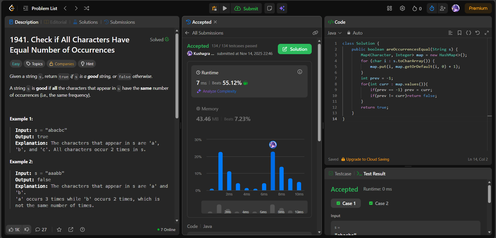

# 🧠 Day 19 – Strings & HashMap (Easy)

**📅 Date:** November 14, 2025  
**💻 Language:** Java  
**📚 Topic:** String Frequency – HashMap & Occurrence Validation  

---

## ✅ Problems Solved
| Problem | LeetCode # | Description |
|:--|:--:|:--|
| [Check if All Characters Have Equal Number of Occurrences](https://leetcode.com/problems/check-if-all-characters-have-equal-number-of-occurrences/) | #1941 | Determine whether all characters in a string occur the same number of times. |

---

## 💡 Concepts Practiced
- Built a **frequency map** using a `HashMap<Character, Integer>`  
- Used `getOrDefault()` to simplify increment logic  
- Compared all character occurrence values to ensure equality  
- Handled edge cases such as single-character or uniform strings  
- Achieved **O(n)** time and **O(1)** space (since only lowercase letters)  
- Strengthened skills in **map traversal**, **frequency comparison**, and **string analysis**

---

## 🧩 Output Screenshots
| Problem | Result |
|:--|:--|
| Check if All Characters Have Equal Number of Occurrences |  |

---

## 🏁 Summary

Day 19 of the **100 Days of DSA** ✅
Implemented a clean **HashMap-based character frequency** solution to check uniformity of occurrences.
Gained confidence in **string processing, value consistency checking, and map operations** 🔠⚙️
