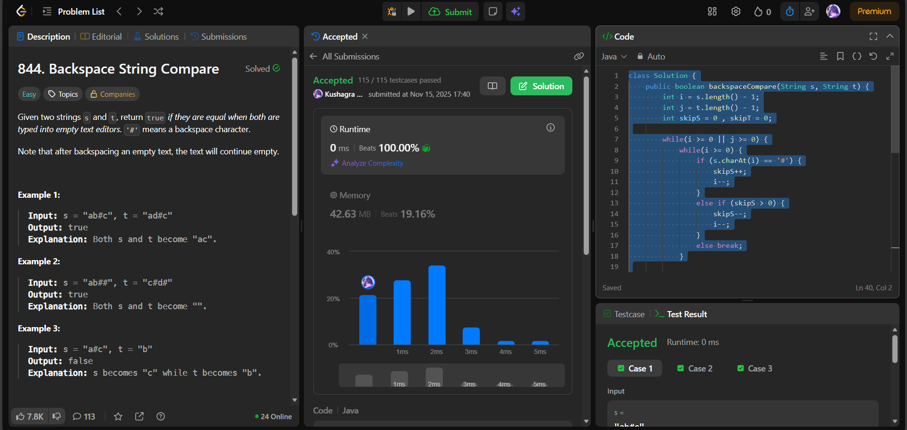

# 🧠 Day 20 – Two Pointers & Strings (Easy)

**📅 Date:** November 15, 2025  
**💻 Language:** Java  
**📚 Topic:** Two-Pointer String Processing – Backspace Simulation  

---

## ✅ Problems Solved
| Problem | LeetCode # | Description |
|:--|:--:|:--|
| [Backspace String Compare](https://leetcode.com/problems/backspace-string-compare/) | #844 | Compare two strings as they would appear after applying backspace operations (`#`). |

---

## 💡 Concepts Practiced
- Used **two pointers** starting from the end of each string  
- Managed **skip counters** to simulate backspaces efficiently  
- Avoided building new strings, achieving **O(1) extra space**  
- Compared characters only when both pointers reach a valid position  
- Checked edge cases where one string finishes early  
- Achieved optimal **O(n + m)** time complexity  

---

## 🧩 Output Screenshots
| Problem | Result |
|:--|:--|
| Backspace String Compare |  |

---

## 🏁 Summary

Day 20 of the **100 Days of DSA** ✅
Solved **Backspace String Compare** using an efficient **two-pointer technique** from the end.
Improved understanding of handling **backspaces, skip logic, and character alignment without reconstructing strings** 🔥⌨️