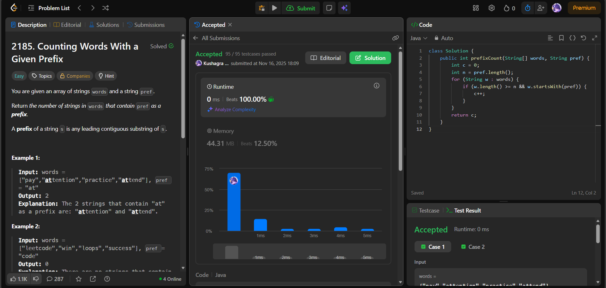

# 🧠 Day 21 – Strings (Easy)

**📅 Date:** November 16, 2025  
**💻 Language:** Java  
**📚 Topic:** String Prefix Matching & Iteration  

---

## ✅ Problems Solved
| Problem | LeetCode # | Description |
|:--|:--:|:--|
| [Counting Words With a Given Prefix](https://leetcode.com/problems/counting-words-with-a-given-prefix/) | #2185 | Count how many words in the array start with a given prefix. |

---

## 💡 Concepts Practiced
- Used **`String.startsWith()`** for prefix validation  
- Ensured safe comparison by checking **word length ≥ prefix length**  
- Practiced efficient **string iteration**  
- Reinforced understanding of **prefix operations**  
- Achieved **O(n * k)** time, where *k* is prefix length (fast for constraints)  
- Strengthened fundamentals of **string handling in Java**

---

## 🧩 Output Screenshots
| Problem | Result |
|:--|:--|
| Counting Words With a Given Prefix |  |

---

## 🏁 Summary
Day 21 of the **100 Days of DSA** ✅
Solved the prefix-counting problem using **simple and efficient string matching**.
Strengthened understanding of **prefix logic, iteration, and Java’s built-in string utilities** 🚀🔤
