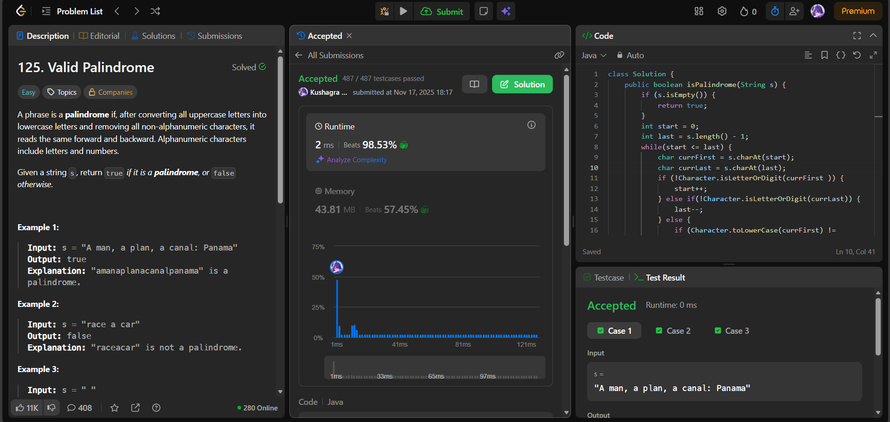

# 🧠 Day 22 – Two Pointers & Strings (Easy)

**📅 Date:** November 17, 2025  
**💻 Language:** Java  
**📚 Topic:** Strings – Palindrome Checking with Two Pointers  

---

## ✅ Problems Solved
| Problem | LeetCode # | Description |
|:--|:--:|:--|
| [Valid Palindrome](https://leetcode.com/problems/valid-palindrome/) | #125 | Check whether a string is a palindrome, considering only alphanumeric characters and ignoring cases. |

---

## 💡 Concepts Practiced
- Implemented **two-pointer technique** (`start` and `end`)  
- Skipped non-alphanumeric characters using `Character.isLetterOrDigit()`  
- Compared characters in a **case-insensitive** manner  
- Handled edge cases like empty strings and symbols-only strings  
- Achieved **O(n)** time and **O(1)** extra space  
- Strengthened string parsing, filtering, and pointer logic  

---

## 🧩 Output Screenshots
| Problem | Result |
|:--|:--|
| Valid Palindrome |  |

---

## 🏁 Summary

Day 22 of the 100 Days of DSA ✅
Solved Valid Palindrome using a two-pointer method, efficiently skipping non-alphanumeric characters and applying case-insensitive comparisons.
Sharpened skills in string cleaning, pointer movement, and constant-space palindrome logic 🔁✨