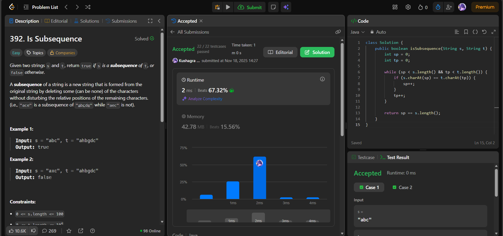

# 🧠 Day 23 – Two Pointers & Strings (Easy)

**📅 Date:** November 18, 2025  
**💻 Language:** Java  
**📚 Topic:** Two-Pointer String Matching  

---

## ✅ Problems Solved
| Problem | LeetCode # | Description |
|:--|:--:|:--|
| [Is Subsequence](https://leetcode.com/problems/is-subsequence/) | #392 | Check whether string `s` is a subsequence of string `t` by scanning characters in order. |

---

## 💡 Concepts Practiced
- Implemented the **two-pointer technique** for ordered subsequence matching  
- Incremented subsequence pointer only when characters match  
- Scanned through the second string (`t`) in a single pass  
- Achieved **O(n + m)** time and **O(1)** extra space  
- Strengthened understanding of **sequence preservation**, **pointer control**, and **string traversal**

---

## 🧩 Output Screenshots
| Problem | Result |
|:--|:--|
| Is Subsequence |  |

---

## 🏁 Summary

Day 23 of the **100 Days of DSA** ✅
Solved Is Subsequence using an elegant and efficient **two-pointer scanning approach**.
Strengthened knowledge of **ordered matching, pointer advancement, and linear-time string algorithms** 🔍
