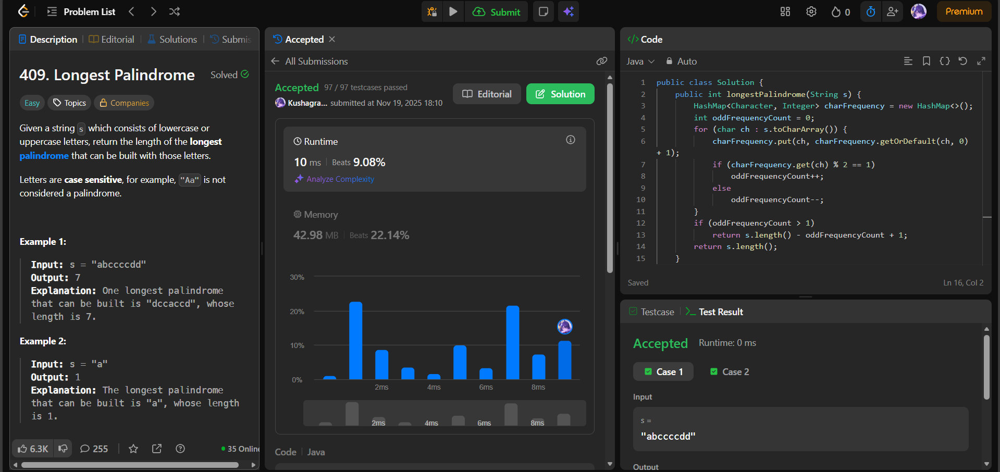

# 🧠 Day 24 – HashMap & Strings (Easy)

**📅 Date:** November 19, 2025  
**💻 Language:** Java  
**📚 Topic:** Frequency Counting & Palindrome Construction  

---

## ✅ Problems Solved
| Problem | LeetCode # | Description |
|:--|:--:|:--|
| [Longest Palindrome](https://leetcode.com/problems/longest-palindrome/) | #409 | Find the maximum length of a palindrome that can be built using the characters of the given string. |

---

## 💡 Concepts Practiced
- Used a **HashMap** to track the frequency of each character  
- Maintained a counter for **odd occurrences**  
- Understood that:  
  - All **even counts** can be fully used  
  - For characters with **odd counts**, we can use their `count - 1`  
  - Only **one odd** frequency can be placed in the middle  
- Implemented logic to compute valid palindrome length in a single pass  
- Achieved **O(n)** time and **O(1)** space (bounded by character set)  

---

## 🧩 Output Screenshots
| Problem | Result |
|:--|:--|
| Longest Palindrome |  |

---

## 🏁 Summary

Day 24 of the **100 Days of DSA** ✅
Solved **Longest Palindrome** by using character frequency parity to determine how many characters can contribute to a maximal palindrome.
Strengthened understanding of **odd-even logic, frequency maps, and palindrome structure** 🧠🔤✨
