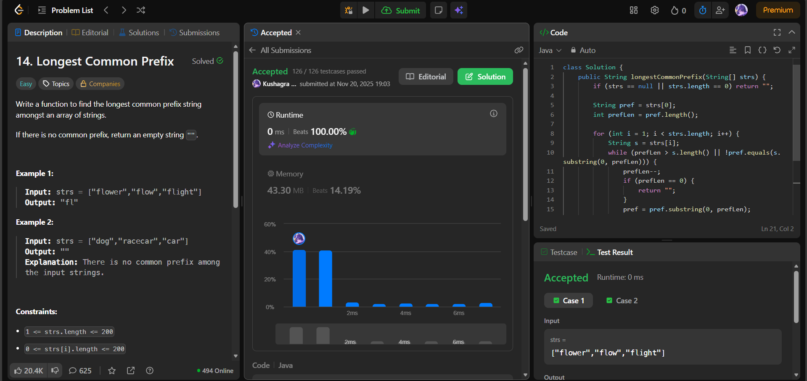

# 🧠 Day 25 – Strings (Easy)

**📅 Date:** November 20, 2025  
**💻 Language:** Java  
**📚 Topic:** Strings – Prefix Matching & Iterative Reduction  

---

## ✅ Problems Solved
| Problem | LeetCode # | Description |
|:--|:--:|:--|
| [Longest Common Prefix](https://leetcode.com/problems/longest-common-prefix/) | #14 | Find the longest prefix shared among all strings in the array. |

---

## 💡 Concepts Practiced
- Started with the **first string as the initial prefix**  
- Used a **shrinking window approach**: shortened the prefix until it matched the current string  
- Handled cases where strings are shorter or incompatible  
- Practiced **substring comparison** and iterative reduction  
- Achieved **O(n * m)** time in the worst case (n = number of strings, m = prefix length)  
- Improved confidence in **string manipulation** and **prefix logic**

---

## 🧩 Output Screenshots
| Problem | Result |
|:--|:--|
| Longest Common Prefix |  |

---

## 🏁 Summary
Day 25 of the **100 Days of DSA** ✅
Solved **Longest Common Prefix** by iteratively reducing a candidate prefix until it matched all strings.
Strengthened understanding of **prefix logic, string slicing, and iterative validation** 🔠✨
