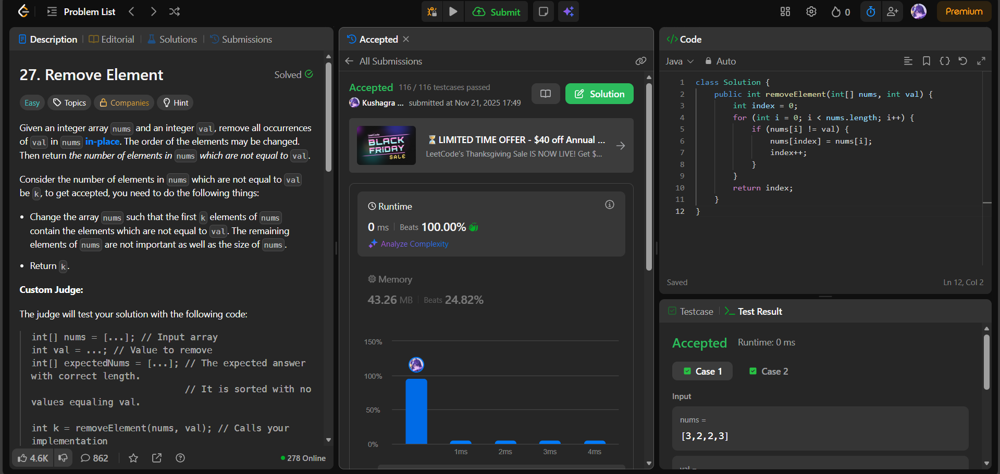

# 🧠 Day 26 – Arrays & Two Pointers (Easy)

**📅 Date:** November 21, 2025  
**💻 Language:** Java  
**📚 Topic:** Arrays – In-Place Removal & Two-Pointer Technique  

---

## ✅ Problems Solved
| Problem | LeetCode # | Description |
|:--|:--:|:--|
| [Remove Element](https://leetcode.com/problems/remove-element/) | #27 | Remove all occurrences of a value from the array in-place and return the new length. |

---

## 💡 Concepts Practiced
- Used the **two-pointer overwrite technique**  
- Moved only the valid (non-`val`) elements to the front  
- Ensured **in-place modification** without extra memory  
- Practiced clean and efficient iteration  
- Achieved **O(n)** time and **O(1)** space complexity  
- Strengthened fundamentals of **index management** and **array filtering**

---

## 🧩 Output Screenshots
| Problem | Result |
|:--|:--|
| Remove Element |  |

---

## 🏁 Summary
Day 26 of the **100 Days of DSA** ✅
Solved **Remove Element** using a simple and optimal **two-pointer** overwrite method.
Improved understanding of **in-place updates, array filtering, and pointer increments** 🚀📊