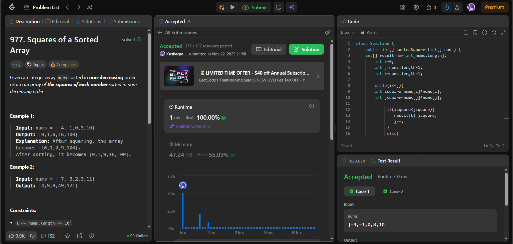

# 🧠 Day 27 – Two Pointers & Arrays (Easy)

**📅 Date:** November 22, 2025  
**💻 Language:** Java  
**📚 Topic:** Arrays – Two-Pointer Technique & Sorted Transformations  

---

## ✅ Problems Solved
| Problem | LeetCode # | Description |
|:--|:--:|:--|
| [Squares of a Sorted Array](https://leetcode.com/problems/squares-of-a-sorted-array/) | #977 | Given a sorted array, return another array of the squares of each number, also sorted. |

---

## 💡 Concepts Practiced
- Used the **two-pointer technique**, starting from both ends  
- Compared squared values of left & right elements  
- Filled the result array from the **end (largest values first)**  
- Handled negative numbers efficiently  
- Achieved **O(n)** time and **O(n)** space  
- Improved understanding of **sorted transformations** and **pointer movement logic**

---

## 🧩 Output Screenshots
| Problem | Result |
|:--|:--|
| Squares of a Sorted Array |  |

---

## 🏁 Summary
Day 27 of the **100 Days of DSA** ✅
Solved Squares of a **Sorted Array** using an efficient **two-pointer approach, placing the largest squared values** from the back.
Enhanced skills in **pointer logic, array reconstruction, and handling negative values effectively** ⚡📊