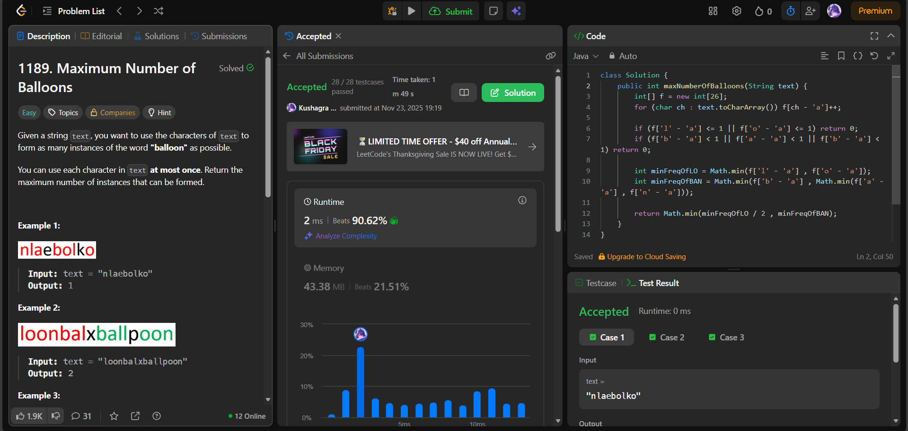

# 🧠 Day 28 – Strings & Frequency Counting (Easy)

**📅 Date:** November 23, 2025  
**💻 Language:** Java  
**📚 Topic:** Character Frequency Counting & String Construction  

---

## ✅ Problems Solved
| Problem | LeetCode # | Description |
|:--|:--:|:--|
| [Maximum Number of Balloons](https://leetcode.com/problems/maximum-number-of-balloons/) | #1189 | Determine how many instances of the word **"balloon"** can be formed from the characters of a given string. |

---

## 💡 Concepts Practiced
- Used a **frequency array of size 26** for constant-time counting  
- Understood that "balloon" has repeating characters →  
  - `'l'` appears **twice**  
  - `'o'` appears **twice**  
- Calculated the limiting factor using **minimum frequency rules**  
- Performed optimized checks without using extra maps or strings  
- Achieved **O(n)** time & **O(1)** space  
- Strengthened skills in **character indexing**, **frequency logic**, and **string construction constraints**

---

## 🧩 Output Screenshots
| Problem | Result |
|:--|:--|
| Maximum Number of Balloons |  |

---

## 🏁 Summary

Day 28 of the **100 Days of DSA** ✅
Solved **Maximum Number of Balloons using a frequency-counting approach**, carefully handling characters that must appear twice.
Improved understanding of **string construction constraints, count-based limits, and array-based frequency mapping** 🎈✨