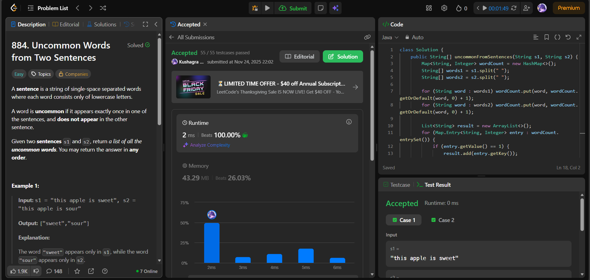

# 🧠 Day 29 – Strings & HashMap (Easy)

**📅 Date:** November 24, 2025  
**💻 Language:** Java  
**📚 Topic:** Word Frequency Counting & Map Processing  

---

## ✅ Problems Solved
| Problem | LeetCode # | Description |
|:--|:--:|:--|
| [Uncommon Words from Two Sentences](https://leetcode.com/problems/uncommon-words-from-two-sentences/) | #884 | Return the words that appear exactly once in the two given sentences combined. |

---

## 💡 Concepts Practiced
- Used **HashMap<String, Integer>** to store word frequencies  
- Split sentences using `String.split(" ")`  
- Counted occurrences efficiently across two sentences  
- Filtered words that appeared **exactly once**  
- Converted the result `List<String>` to a **String[]**  
- Achieved **O(n)** time and optimal space usage  
- Strengthened skills in **map operations**, **string tokenization**, and **frequency analysis**

---

## 🧩 Output Screenshots
| Problem | Result |
|:--|:--|
| Uncommon Words from Two Sentences |  |

---

## 🏁 Summary
Day 29 of the **100 Days of DSA** ✅
Solved **Uncommon Words from Two Sentences** using a simple and effective frequency counting approach.
Improved understanding of **string splitting, map-based counting, and unique word extraction** 🗣️✨
