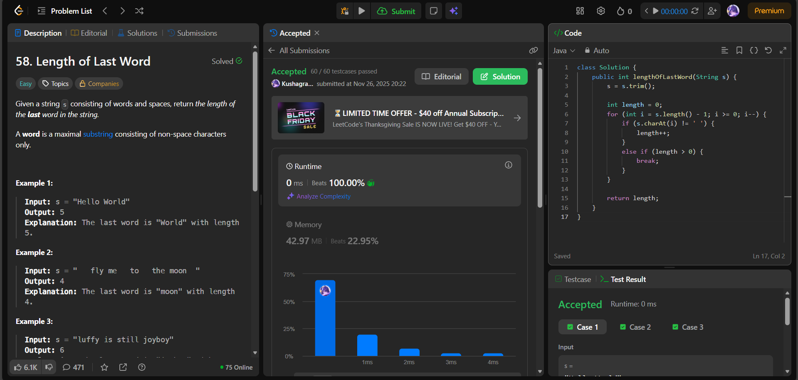

# 🧠 Day 31 – Strings (Easy)

**📅 Date:** November 25, 2025  
**💻 Language:** Java  
**📚 Topic:** String Trimming & Reverse Traversal  

---

## ✅ Problems Solved
| Problem | LeetCode # | Description |
|:--|:--:|:--|
| [Length of Last Word](https://leetcode.com/problems/length-of-last-word/) | #58 | Find the length of the last word in a string after trimming trailing spaces. |

---

## 💡 Concepts Practiced
- Used `String.trim()` to remove leading/trailing spaces  
- Applied **reverse scanning** to count characters of the last word  
- Reset and stop counting at the first space after the last word  
- Handled edge cases like:
  - Multiple trailing spaces
  - Single-word strings
  - Space-heavy strings  
- Achieved **O(n)** time and **O(1)** extra space  
- Improved understanding of **string parsing, whitespace handling, and loop control**

---

## 🧩 Output Screenshots
| Problem | Result |
|:--|:--|
| Length of Last Word |  |

---

## 🏁 Summary
Day 31 of the **100 Days of DSA** ✅
Solved **Length of Last Word** using string trimming and reverse iteration.
Strengthened skills in **handling whitespace edge cases and loop flow precision** 🔍⚙️✨