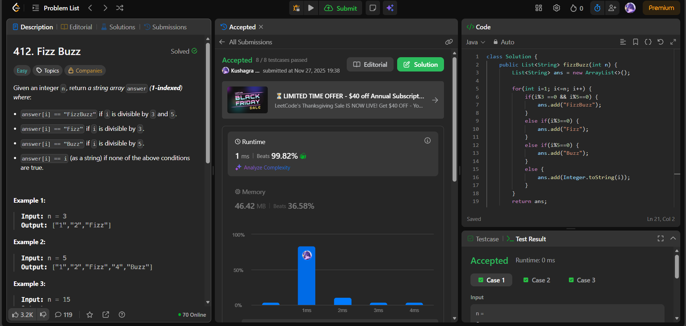

# 🧠 Day 32 – Iteration & Conditionals (Easy)

**📅 Date:** November 26, 2025  
**💻 Language:** Java  
**📚 Topic:** Basic Logic, Looping & String Output Formatting  

---

## ✅ Problems Solved
| Problem | LeetCode # | Description |
|:--|:--:|:--|
| [Fizz Buzz](https://leetcode.com/problems/fizz-buzz/) | #412 | Generate a list of numbers from 1 to `n` with multiples of 3 replaced by `"Fizz"`, multiples of 5 replaced by `"Buzz"`, and multiples of both replaced by `"FizzBuzz"`. |

---

## 💡 Concepts Practiced
- Used a **single loop** from `1` to `n`  
- Applied **modulo-based divisibility rules**  
- Constructed and stored results in a **dynamic `ArrayList<String>`**  
- Converted integers to strings using `Integer.toString()` when needed  
- Maintained clean **branch order: FizzBuzz → Fizz → Buzz → Number**  
- Achieved **O(n)** time complexity  
- Practiced writing **simple, readable, and logic-driven code**

---

## 🧩 Output Screenshots
| Problem | Result |
|:--|:--|
| Fizz Buzz |  |

---

## 🏁 Summary
Day 32 of the **100 Days of DSA** ✅
Solved the classic **Fizz Buzz** challenge by combining **looping + string formatting + conditional branching**.
Strengthened core skills in **control flow, divisibility checks, and clean list output generation** ⚡🔁✨