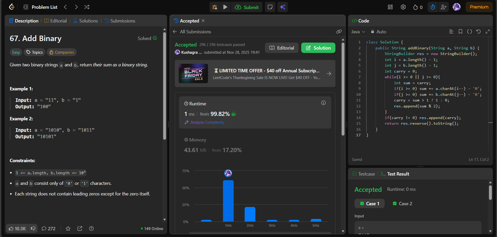

# 🧠 Day 33 – Bit Manipulation & Strings (Easy)

**📅 Date:** November 27, 2025  
**💻 Language:** Java  
**📚 Topic:** Binary Addition, Carry Handling & StringBuilder Operations  

---

## ✅ Problems Solved
| Problem | LeetCode # | Description |
|:--|:--:|:--|
| [Add Binary](https://leetcode.com/problems/add-binary/) | #67 | Add two binary strings and return the resulting binary string while simulating carry like manual binary addition. |

---

## 💡 Concepts Practiced
- Used **reverse traversal** of both strings for right-to-left addition  
- Simulated binary sum using **carry accumulation**  
- Converted characters to integers using `'ch - '0'` logic  
- Appended results using **`StringBuilder`** for efficient string construction  
- Managed bit overflow safely and added final carry when required  
- Achieved **O(max(n, m))** time complexity and **O(1)** auxiliary space  
- Practiced clean and compact **bit-wise string parsing**

---

## 🧩 Output Screenshots
| Problem | Result |
|:--|:--|
| Add Binary |  |

---

## 🏁 Summary
Day 33 of the **100 Days of DSA** ✅
Implemented **binary string addition using efficient reverse iteration** and **carry simulation without converting to integers directly**.
Strengthened understanding of **bit math, carry flow, and in-place string building** ⚡🔢✨
