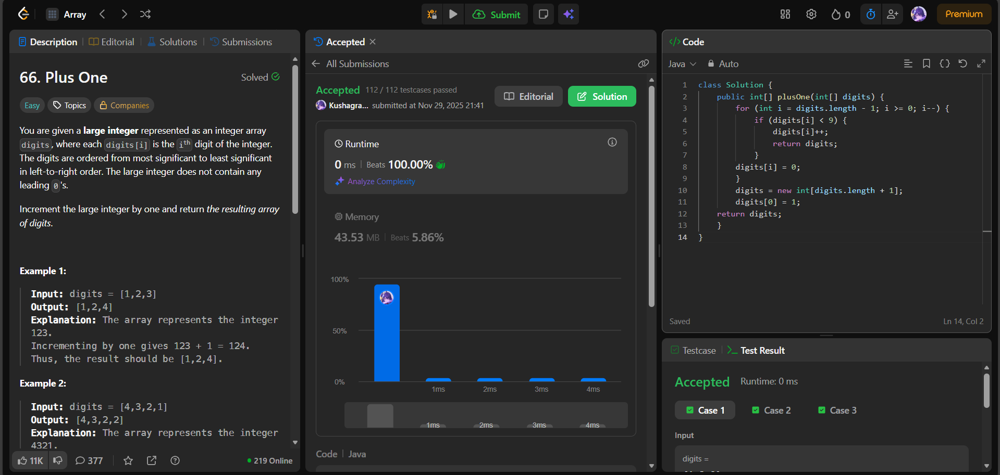

# 🧠 Day 34 – Arrays (Easy)

**📅 Date:** November 27, 2025  
**💻 Language:** Java  
**📚 Topic:** Array Traversal, Carry Propagation & In-Place Digit Manipulation  

---

## ✅ Problems Solved
| Problem | LeetCode # | Description |
|:--|:--:|:--|
| [Plus One](https://leetcode.com/problems/plus-one/) | #66 | Increment a large integer represented as an array of digits, handling carry propagation without string/integer conversion. |

---

## 💡 Concepts Practiced
- Used **reverse traversal** to simulate manual addition from the least significant digit  
- Performed **in-place updates** for memory efficiency  
- Handled **carry flow implicitly** by resetting `9 → 0`  
- Created a new array when all digits roll over (e.g., `999 → 1000`)  
- Achieved **O(n)** time and **O(1)** extra space (ignoring final carry array creation)  
- Strengthened understanding of **carry propagation** and **array mutation rules**  

---

## 🧩 Output Screenshots
| Problem | Result |
|:--|:--|
| Plus One |  |

---

## 🏁 Summary
Day 34 of the **100 Days of DSA** ✅
Implemented **digit increment with carry propagation** using an efficient **reverse scan and in-place mutation strategy**.
Reinforced skills in **boundary control, early exit patterns, and carry simulation using arrays** 🚀🔢✨
