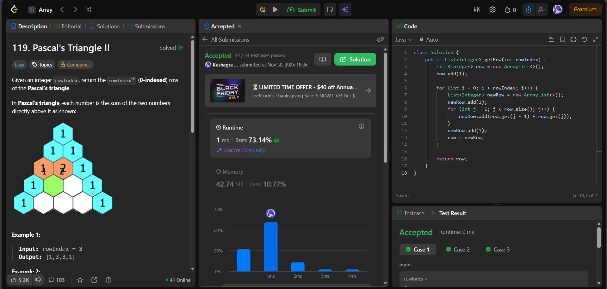

# 🧠 Day 35 – Dynamic Programming & Arrays (Easy)

**📅 Date:** November 28, 2025  
**💻 Language:** Java  
**📚 Topic:** Pascal’s Triangle Row Generation & Iterative DP  

---

## ✅ Problems Solved
| Problem | LeetCode # | Description |
|:--|:--:|:--|
| [Pascal's Triangle II](https://leetcode.com/problems/pascals-triangle-ii/) | #119 | Return the `kth` (0-indexed) row of Pascal’s Triangle using iterative in-place dynamic programming. |

---

## 💡 Concepts Practiced
- Applied **iterative dynamic programming** to build rows sequentially  
- Used **arraylist-based in-place updates** instead of 2D arrays  
- Computed inner values using the previous row’s adjacent pair sum  
- Maintained **O(k)** space complexity at each iteration  
- Understood triangle properties:
  - Each row starts/ends with `1`
  - Middle elements = `row[j-1] + row[j]` from previous row  
- Achieved **O(k²)** time for row build and **minimal memory usage**  
- Practiced **list reassignment and loop boundary control**

---

## 🧩 Output Screenshots
| Problem | Result |
|:--|:--|
| Pascal's Triangle II |  |

---

## 🏁 Summary

Day 35 of the **100 Days of DSA** ✅
Generated a specific row of Pascal’s Triangle using **iterative dynamic row building**.
Strengthened skills in **list-based DP, adjacent sum computation, and efficient space usage** 🔺⚙️🚀