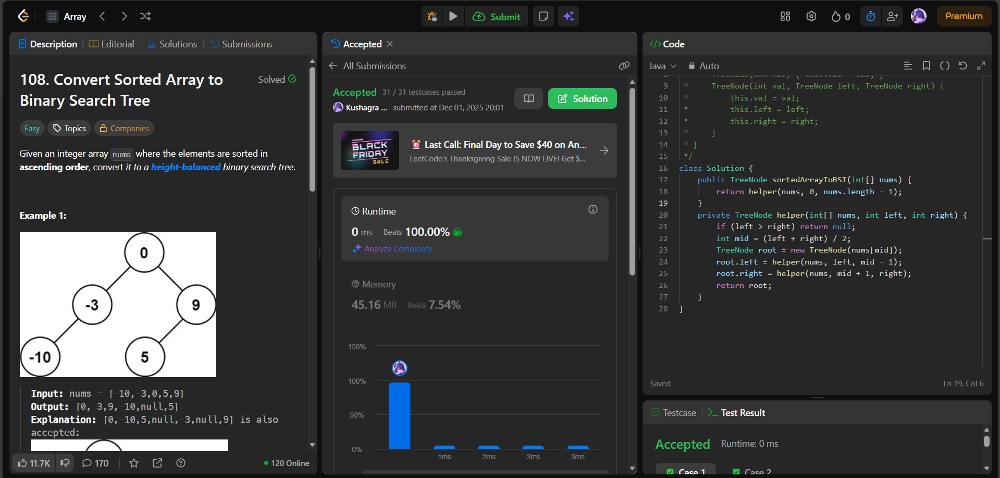

# 🌳 Day 36 – Trees & Binary Search (Easy)

**📅 Date:** November 27, 2025  
**💻 Language:** Java  
**📚 Topic:** Balanced BST Construction from Sorted Array  

---

## ✅ Problems Solved
| Problem | LeetCode # | Description |
|:--|:--:|:--|
| [Convert Sorted Array to Binary Search Tree](https://leetcode.com/problems/convert-sorted-array-to-binary-search-tree/) | #108 | Construct a height-balanced Binary Search Tree (BST) from a sorted array using divide-and-conquer recursion. |

---

## 💡 Concepts Practiced
- Applied **divide & conquer** strategy using **binary search midpoint**  
- Built a **height-balanced BST** by selecting `mid` as root at each step  
- Used **recursion to partition left and right subtrees**  
- Handled **base case** where `left > right → null`  
- Preserved **BST properties**:
  - Left subtree < Root < Right subtree  
  - Tree remains sorted inherently due to input order  
- Achieved **O(n)** time and **O(log n)** space (recursion stack)  
- Strengthened intuition for **balanced tree construction & array splitting**

---

## 🧩 Output Screenshots
| Problem | Result |
|:--|:--|
| Convert Sorted Array to Binary Search Tree |  |

---

## 🏁 Summary
Day 36 of the **100 Days of DSA** ✅
Converted a **sorted array** into a **height-balanced BST** by recursively selecting the midpoint as the root, ensuring **BST validity and balanced height**.
Improved understanding of **tree recursion, partition logic, and balanced structure guarantees** 🌿⚡