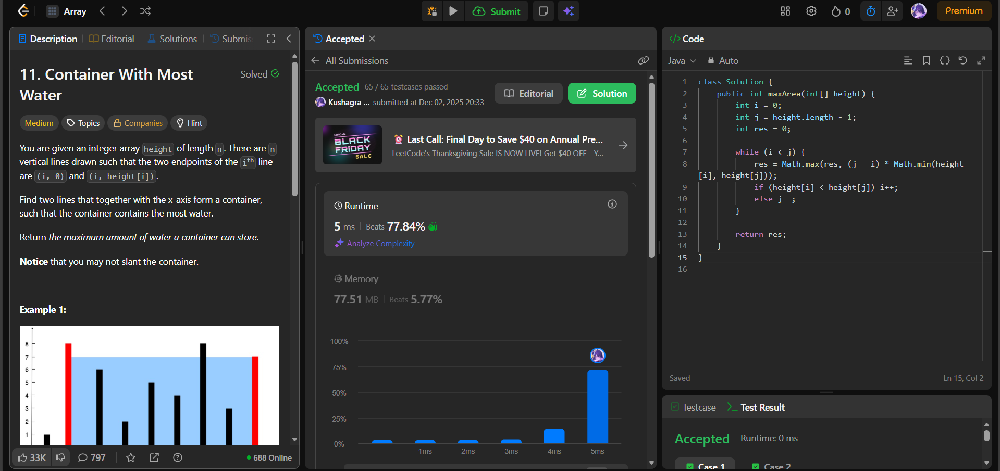

# 🧠 Day 37 – Two Pointers & Greedy (Medium)

**📅 Date:** November 28, 2025  
**💻 Language:** Java  
**📚 Topic:** Two-Pointer Optimization & Max Area Calculation  

---

## ✅ Problems Solved
| Problem | LeetCode # | Description |
|:--|:--:|:--|
| [Container With Most Water](https://leetcode.com/problems/container-with-most-water/) | #11 | Find two lines that, together with the x-axis, form a container that holds the maximum amount of water. |

---

## 💡 Concepts Practiced
- Applied the **two-pointer technique** to avoid O(n²) brute force  
- Used **width × min(height[i], height[j])** to calculate container area  
- Moved the pointer with the **shorter height** for optimal gain  
- Maintained a running maximum efficiently  
- Achieved **O(n)** time and **O(1)** space  
- Strengthened understanding of **greedy pointer movement** and **area maximization logic**

---

## 🧩 Output Screenshots
| Problem | Result |
|:--|:--|
| Container With Most Water |  |

---

## 🏁 Summary
Day 37 of the **100 Days of DSA** ✅
Solved **Container With Most Water** using an efficient **two-pointer greedy approach**, avoiding brute force while maintaining optimal correctness.
Strengthened intuition for **pointer movement, max area tracking, and mathematical reasoning** 💧📊⚡