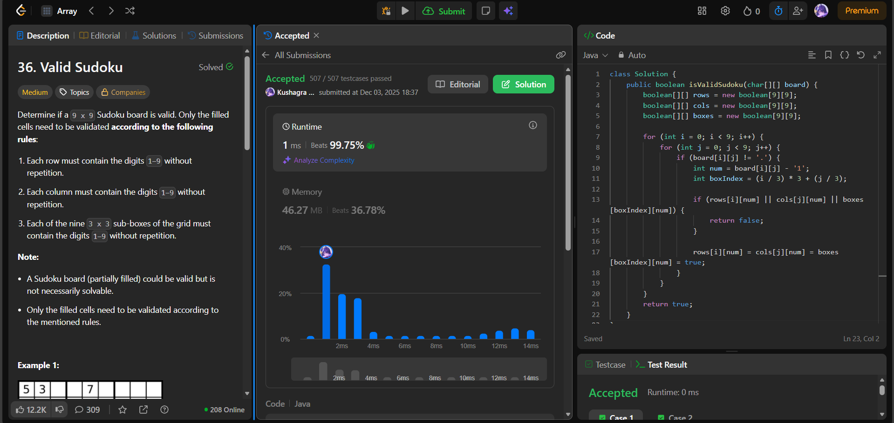

# 🧠 Day 38 – Hashing & Validation Logic (Medium)

**📅 Date:** December 03, 2025  
**💻 Language:** Java  
**📚 Topic:** Hashing, Constraints Checking, Grid Validation  

---

## ✅ Problems Solved
| Problem | LeetCode # | Description |
|:--|:--:|:--|
| [Valid Sudoku](https://leetcode.com/problems/valid-sudoku/) | #36 | Check whether a partially filled Sudoku board follows all Sudoku rules. |

---

## 💡 Concepts Practiced
- Used **boolean matrices** to track occurrences of digits in:
  - each **row**
  - each **column**
  - each **3×3 sub-box**
- Converted characters `'1'–'9'` into integer indices using `board[i][j] - '1'`
- Calculated sub-box index using:  
  `boxIndex = (i / 3) * 3 + (j / 3)`
- Checked for repeated digits in row/col/box  
- Achieved **O(1)** time (81 operations) and **O(1)** space  
- Strengthened understanding of efficient **grid validation logic**  

---

## 🧩 Output Screenshots
| Problem | Result |
|:--|:--|
| Valid Sudoku |  |

---

## 🏁 Summary
Day 38 of the **100 Days of DSA** 🔥
Solved **Valid Sudoku**, improving skills in **hashing, boolean mapping, and validation patterns**.
A clean and efficient approach to checking grids with confidence ✔️✨