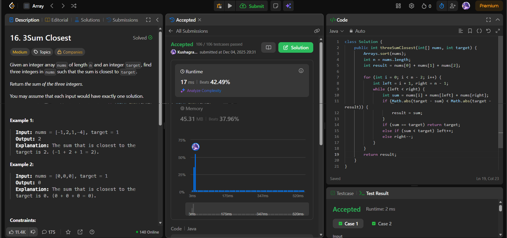

# 🧠 Day 39 – Two Pointers on Sorted Array (Medium)

**📅 Date:** December 04, 2025  
**💻 Language:** Java  
**📚 Topic:** Sorting + Two Pointers + Closest Sum Optimization  

---

## ✅ Problems Solved
| Problem | LeetCode # | Description |
|:--|:--:|:--|
| [3Sum Closest](https://leetcode.com/problems/3sum-closest/) | #16 | Find three numbers whose sum is closest to the target value. |

---

## 💡 Concepts Practiced
- Used **sorting + two pointers** to reduce complexity from O(n³) to **O(n²)**
- Fixed one number and used a **left–right pointer pair** to compute sums
- Tracked the **closest sum** using:  
  `Math.abs(target - sum)`
- Updated `result` whenever a **better (closer)** sum was found
- Early exit when `sum == target` because it's already the **best possible answer**
- Strengthened intuition for **pointer movement** based on comparing sum vs target

---

## 🧩 Output Screenshots
| Problem | Result |
|:--|:--|
| 3Sum Closest |  |

---

## 🏁 Summary
Day 39 of the **100 Days of DSA** 
Applied **sorting + two-pointer** technique to efficiently compute the closest possible sum to the target.
Great practice for **search space pruning, sum comparison, and optimized pointer movement** 🎯⚡