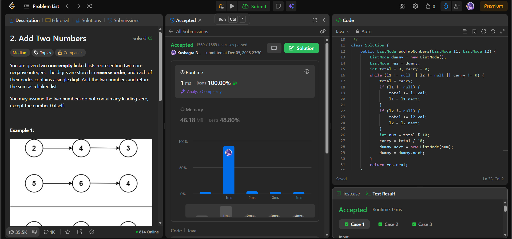

# 🧠 Day 40 – Linked List Arithmetic (Medium)

**📅 Date:** December 05, 2025  
**💻 Language:** Java  
**📚 Topic:** Linked Lists, Digit-by-Digit Addition  

---

## ✅ Problems Solved
| Problem | LeetCode # | Description |
|:--|:--:|:--|
| [Add Two Numbers](https://leetcode.com/problems/add-two-numbers/) | #2 | Add two numbers represented as linked lists (digits stored in reverse order). |

---

## 💡 Concepts Practiced
- Used a **dummy head node** to easily build the result list
- Performed **digit-wise addition** with:
  - current digit value  
  - carry from previous addition  
- Moved through both linked lists simultaneously  
- Handled cases where:
  - lists have **unequal lengths**
  - an extra **carry** remains at the end  
- Learned how to manipulate pointers to build a new linked list efficiently  
- Time complexity: **O(max(n, m))**  
- Space complexity: **O(max(n, m))** (result list)

---

## 🧩 Output Screenshots
| Problem | Result |
|:--|:--|
| Add Two Numbers |  |

---

## 🏁 Summary
Day 40 of the **100 Days of DSA** 💡
Solved Add Two Numbers, strengthening understanding of:
**- Linked list traversal**
**- Carry-forward arithmetic**
**- Pointer manipulation**
**- Building new lists efficiently**
One of the most important linked-list foundation problems 🔗⚡