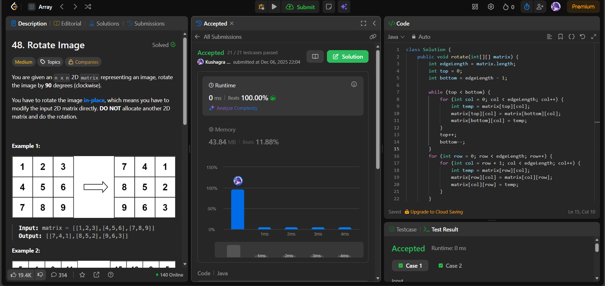

# 🧠 Day 41 – Matrix Manipulation & In-Place Rotation (Medium)

**📅 Date:** December 06, 2025  
**💻 Language:** Java  
**📚 Topic:** 2D Matrix Rotation, In-Place Algorithms  

---

## ✅ Problems Solved
| Problem | LeetCode # | Description |
|:--|:--:|:--|
| [Rotate Image](https://leetcode.com/problems/rotate-image/) | #48 | Rotate a square matrix by 90° clockwise in-place. |

---

## 💡 Concepts Practiced
- Achieved **in-place 90° rotation** using a **two-step transformation**:
  1. **Reverse the matrix vertically**  
     (swap top row with bottom row, then move inward)
  2. **Transpose the matrix**  
     (swap `matrix[i][j]` with `matrix[j][i]`)
- Learned how matrix reversing + transposing = efficient rotation  
- No extra matrix needed → **O(1) space**
- Time complexity: **O(n²)**  
- Strengthened skills in:
  - **2D indexing**
  - **in-place swapping**
  - **symmetry-based transformations**

---

## 🧩 Output Screenshots
| Problem | Result |
|:--|:--|
| Rotate Image |  |

---

## 🏁 Summary
Day 41 of the **100 Days of DSA** 🔄
Mastered rotating a matrix **in-place** using two elegant transformations:
**Reverse + Transpose = 90° Clockwise Rotation.**
Built deeper intuition for matrix operations and symmetrical swaps 🎯✨