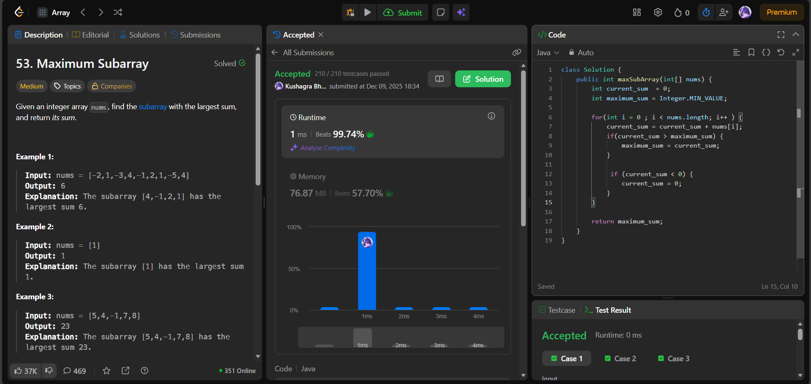

# 🧠 Day 43 – Kadane’s Algorithm & Maximum Subarray Sum (Easy/Medium)

**📅 Date:** December 08, 2025  
**💻 Language:** Java  
**📚 Topic:** Kadane’s Algorithm, Dynamic Running Sum  

---

## ✅ Problems Solved
| Problem | LeetCode # | Description |
|:--|:--:|:--|
| [Maximum Subarray](https://leetcode.com/problems/maximum-subarray/) | #53 | Find the contiguous subarray with the largest possible sum. |

---

## 💡 Concepts Practiced
- Implemented **Kadane’s Algorithm**, a classic DP/greedy hybrid  
- Maintained two running values:
  - `current_sum` → best sum ending at the current index  
  - `maximum_sum` → global best sum seen so far  
- Reset `current_sum` to 0 whenever it dropped below 0  
- Intuition:  
  - Negative prefix cannot help future subarrays  
  - Only extend when sum is positive  
- Time complexity: **O(n)**  
- Space complexity: **O(1)**  
- Strengthened understanding of **running window sums**, DP transitions, and array scanning logic  

---

## 🧩 Output Screenshots
| Problem | Result |
|:--|:--|
|Maximum Subarray |  |

---

## 🏁 Summary
Day 43 of the **100 Days of DSA** ⚡
Applied **Kadane’s Algorithm** to efficiently compute the maximum subarray sum using a single pass.
A foundational technique that builds intuition for **DP, sliding sums, and contiguous subarray logic** — powerful and elegant 🚀🔥