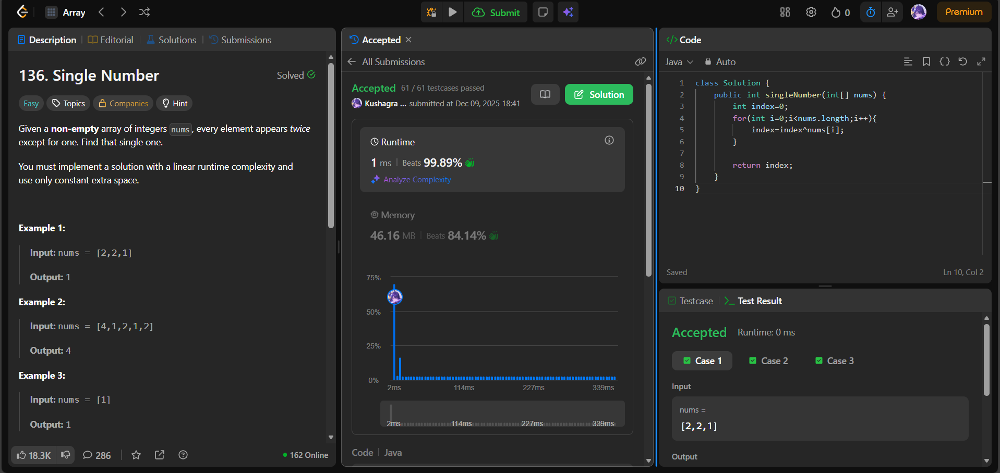

# 🧠 Day 44 – Bit Manipulation & XOR Logic (Easy)

**📅 Date:** December 09, 2025  
**💻 Language:** Java  
**📚 Topic:** XOR Properties, Frequency Elimination  

---

## ✅ Problems Solved
| Problem | LeetCode # | Description |
|:--|:--:|:--|
| [Single Number](https://leetcode.com/problems/single-number/) | #136 | Find the element that appears exactly once when every other number appears twice. |

---

## 💡 Concepts Practiced
- Used **XOR (`^`) operation** to eliminate paired numbers  
- Leveraged key XOR properties:
  - `a ^ a = 0`  
  - `a ^ 0 = a`  
  - XOR is **commutative and associative**  
- Efficiently removed duplicates without extra memory  
- Achieved:
  - **O(n)** time  
  - **O(1)** space  
- Strengthened understanding of **bitwise operations** and zero-cost frequency tracking  

---

## 🧩 Output Screenshots
| Problem | Result |
|:--|:--|
| Single Number |  |

---

## 🏁 Summary
Day 44 of the **100 Days of DSA** ⚡
Solved **Single Number** using the elegant power of **XOR-based cancellation**, a technique that removes duplicates without extra data structures.
Bit manipulation continues to show how efficient low-level operations can simplify real problems 🔥