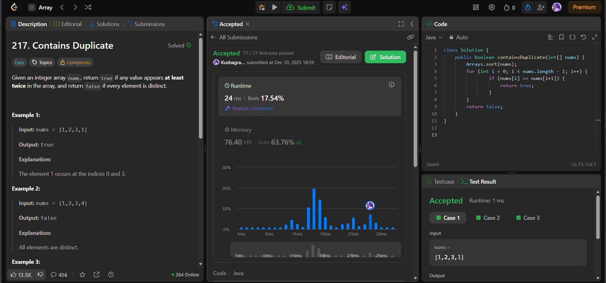

# 🧠 Day 45 – Duplicate Detection Using Sorting (Easy)

**📅 Date:** December 10, 2025  
**💻 Language:** Java  
**📚 Topic:** Array Sorting, Duplicate Identification  

---

## ✅ Problems Solved
| Problem | LeetCode # | Description |
|:--|:--:|:--|
| [Contains Duplicate](https://leetcode.com/problems/contains-duplicate/) | #217 | Check if any value appears at least twice in the array. |

---

## 💡 Concepts Practiced
- Used **sorting** to place equal elements next to each other  
- Scanned through sorted array to detect consecutive duplicates  
- Logical reasoning:
  - If duplicates exist → they become neighbors after sorting  
- Time complexity:
  - Sorting: **O(n log n)**
  - Scan: **O(n)**
- Space complexity: **O(1)** (if in-place sorting is allowed)
- Reinforced understanding of:
  - Duplicate detection strategies  
  - How sorting reveals structure in data  

---

## 🧩 Output Screenshots
| Problem | Result |
|:--|:--|
| Contains Duplicate |  |

---

## 🏁 Summary
Day 45 of the **100 Days of DSA** 🔍
Solved **Contains Duplicate** using an efficient sorting-based approach.
Sorting simplifies the problem dramatically and makes duplicate detection intuitive and fast.
A simple yet powerful pattern in array analysis ✔️