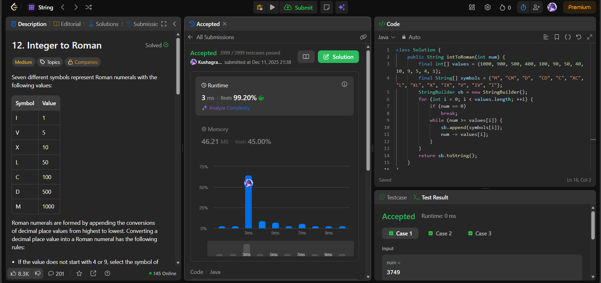

# 🧠 Day 46 – Greedy Conversion & Roman Numeral Logic (Medium)

**📅 Date:** December 11, 2025  
**💻 Language:** Java  
**📚 Topic:** Greedy Algorithm, Symbol Mapping  

---

## ✅ Problems Solved
| Problem | LeetCode # | Description |
|:--|:--:|:--|
| [Integer to Roman](https://leetcode.com/problems/integer-to-roman/) | #12 | Convert an integer into its Roman numeral representation using optimal symbol subtraction. |

---

## 💡 Concepts Practiced
- Followed a **greedy approach** using descending Roman numeral values  
- Used parallel arrays of:
  - `values[]` → Roman numeral integer values  
  - `symbols[]` → their corresponding symbols  
- Subtracted the largest possible value repeatedly while building output  
- Key Roman numeral rules handled by:
  - `900 → CM`
  - `400 → CD`
  - `90 → XC`
  - `40 → XL`
  - `9 → IX`
  - `4 → IV`
- Ensured correct representation without additional condition checks  
- Time complexity: **O(1)** (fixed number of mappings)  
- Strengthened understanding of **mapping-based greedy strategies**

---

## 🧩 Output Screenshots
| Problem | Result |
|:--|:--|
| Integer to Roman |  |

---

## 🏁 Summary
Day 46 of the **100 Days of DSA** ✨
Solved **Integer to Roman** using a clean and powerful greedy strategy with predefined numeral mappings.
A great problem to build intuition for **symbolic mapping, greedy subtraction, and optimal representation logic** 🔥