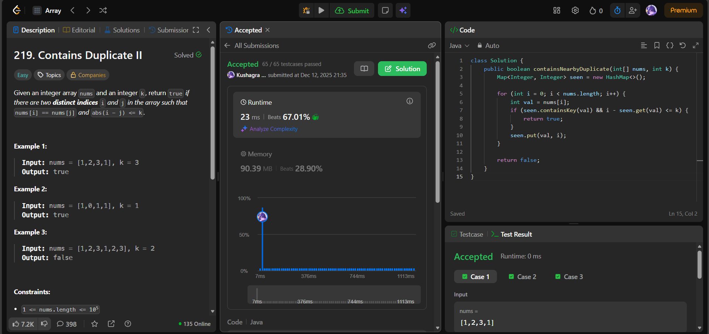

# 🧠 Day 47 – HashMap Window Tracking (Easy/Medium)

**📅 Date:** December 12, 2025  
**💻 Language:** Java  
**📚 Topic:** HashMap, Sliding Window Index Tracking  

---

## ✅ Problems Solved
| Problem | LeetCode # | Description |
|:--|:--:|:--|
| [Contains Duplicate II](https://leetcode.com/problems/contains-duplicate-ii/) | #219 | Check if any value appears twice such that the indices are at most `k` apart. |

---

## 💡 Concepts Practiced
- Used a **HashMap<Integer, Integer>** to store the last seen index of each value  
- For each element:
  - If seen before, checked whether  
    `i - lastIndex <= k`  
  - If true → nearby duplicate found  
- Updated index on each iteration to maintain the latest position  
- Efficient approach:
  - Time complexity: **O(n)**
  - Space complexity: **O(n)** (storing seen indices)
- Strengthened understanding of:
  - Hash-based window tracking  
  - Distance constraints between indices  
  - Duplicate detection in bounded index ranges  

---

## 🧩 Output Screenshots
| Problem | Result |
|:--|:--|
| Contains Duplicate II |  |

---

## Summary
Day 47 of the **100 Days of DSA** 🔍
Solved **Contains Duplicate II** using HashMap-based index tracking to efficiently detect duplicates within distance k.
A great exercise in applying s**liding-window thinking, constraint checks, and hash-based optimization** ⚙️📏