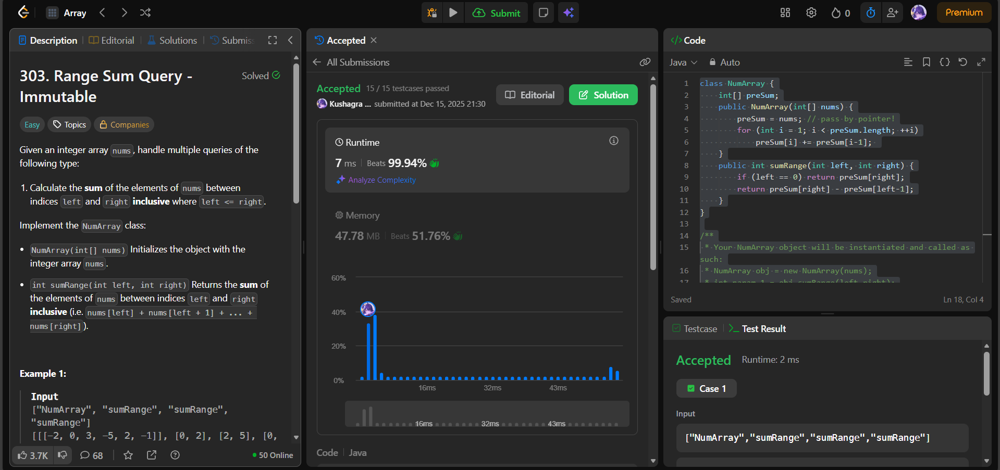

# 🧠 Day 50 – Prefix Sums & Efficient Range Queries (Easy)

**📅 Date:** December 15, 2025  
**💻 Language:** Java  
**📚 Topic:** Prefix Sum Array, Constant-Time Range Queries  

---

## ✅ Problems Solved
| Problem | LeetCode # | Description |
|:--|:--:|:--|
| [Range Sum Query — Immutable](https://leetcode.com/problems/range-sum-query-immutable/) | #303 | Preprocess array into prefix sums to answer `sumRange` queries in O(1). |

---

## 💡 Concepts Practiced
- Built a **prefix sum array (cumulative sum)** to preprocess input  
- Used formula:  
  - `sum[left → right] = pre[right] - pre[left - 1]`
- Special handling when `left == 0`  
- Achieved:
  - Preprocessing: **O(n)**  
  - Query time: **O(1)**  
- Key learning:
  - Prefix sums avoid repeated summation  
  - Powerful technique for multiple range queries  
  - Memory reused by storing prefix in the original array (**pass-by-pointer optimization**)  

---

## 🧩 Output Screenshots
| Problem | Result |
|:--|:--|
| RangeSumQueryImmutable |  |

---

## 🏁 Summary
🎉 Day 50 of the **100 Days of DSA — Milestone Reached!**
Solved **Range Sum Query** – Immutable, reinforcing the power of **prefix sums** for fast, repeated range computations.
Prefix arrays remain one of the most elegant and efficient preprocessing strategies in algorithm design ⚡📘

**Halfway to 100** — onwards and upwards 🚀🔥