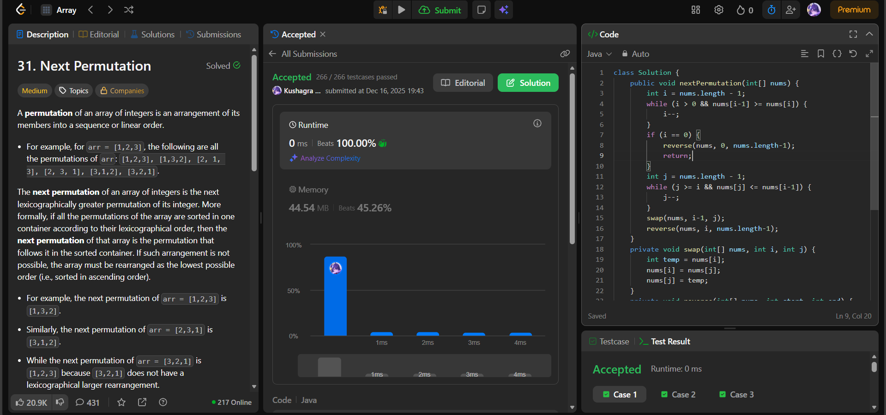

# 🧠 Day 51 – Lexicographical Permutation Manipulation (Medium)

**📅 Date:** December 16, 2025  
**💻 Language:** Java  
**📚 Topic:** Next Permutation, Greedy + Two-Pointer Logic  

---

## ✅ Problems Solved
| Problem | LeetCode # | Description |
|:--|:--:|:--|
| [Next Permutation](https://leetcode.com/problems/next-permutation/) | #31 | Rearrange numbers into the lexicographically next greater permutation. |

---

## 💡 Concepts Practiced
- Implemented the **classic next-permutation algorithm**:
  1. **Find the pivot**:  
     Scan from right until finding `nums[i-1] < nums[i]`  
     (first decreasing point from the end)
  2. **Find the next greater element** to the pivot on the right side  
     (smallest element greater than `nums[i-1]`)
  3. **Swap** pivot with that element
  4. **Reverse** the suffix (i → end) to make it the smallest possible arrangement
- Edge case:  
  If the array is entirely descending → reverse to get the lowest permutation
- Time complexity: **O(n)**  
- Space complexity: **O(1)**  
- Strengthened understanding of:
  - Greedy construction  
  - Lexicographic ordering  
  - In-place rearrangement  

---

## 🧩 Output Screenshots
| Problem | Result |
|:--|:--|
| Next Permutation |  |

---

## 🏁 Summary

Day 51 of the **100 Days of DSA** 🔄
Solved **Next Permutation**, a fundamental problem in lexicographic ordering and greedy in-place operations.
This algorithm forms the backbone of many combinatorial generation techniques and is essential for permutation-based logic 🧩⚡